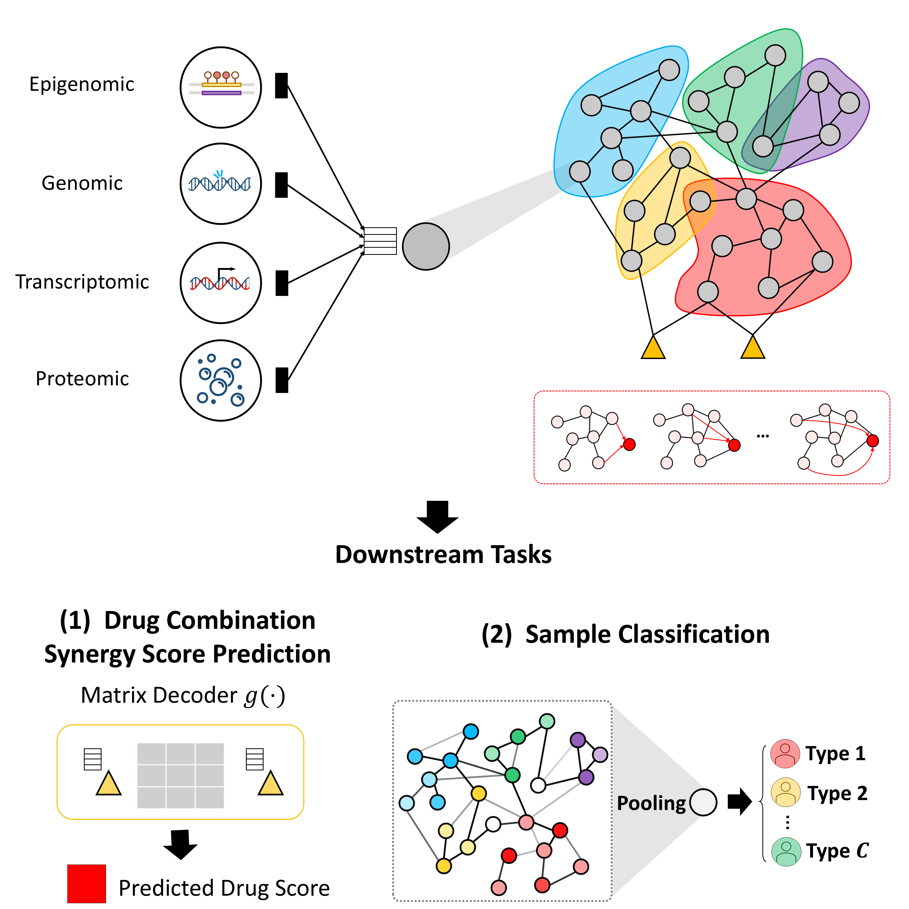

# M3NetFlow: Multi-scale, Multi-hop Graph AI for Integrative Multi-omic Analysis

<p align="center">
  <a href="https://www.cell.com/iscience/fulltext/S2589-0042(25)00180-4">
    
  </a>
  <a href="https://github.com/FuhaiLiAiLab/M3NetFlow">
    
  </a>
  <a href="https://m3netflow.shinyapps.io/NetFlowVis/">
    
  </a>
  <a href="https://m3netflow.shinyapps.io/NetFlowVis-AD/">
    
  </a>
</p>

<p align="center">
  
</p>

## Overview

Multi-omic data-driven studies are at the forefront of precision medicine by characterizing complex disease signaling systems across multiple views and levels. The integration and interpretation of multi-omic data are critical for identifying disease targets and deciphering disease signaling pathways, yet remain challenging due to dense, multi-protein interactions.  
**M3NetFlow** addresses this gap with a **multi-scale, multi-hop, multi-omic network flow model** that supports both **hypothesis-guided** and **generic** analyses. We validate M3NetFlow on two case studies:  
1) uncovering mechanisms behind **synergistic drug combinations** (anchor-target guided analysis), and  
2) identifying **biomarkers of Alzheimer’s disease (AD)** (generic analysis).  
Across evaluations, M3NetFlow achieves **state-of-the-art predictive performance** and highlights **drug-synergy and disease-associated targets**, and can be readily applied to other multi-omic tasks.

---

## Contents

- [Overview](#overview)
- [1. Parsing the Raw Data Files](#1-parsing-the-raw-data-files)
  - [1.1 Cancer datasets preprocessing](#11-cancer-datasets-preprocessing)
  - [1.2 ROSMAP AD dataset preprocessing](#12-rosmap-ad-dataset-preprocessing)
- [2. Run the Model](#2-run-the-model)
  - [2.1 Run M3NetFlow](#21-run-m3netflow)
  - [2.2 Run baselines](#22-run-baselines)
  - [2.3 Model performance and comparisons](#23-model-performance-and-comparisons)
- [3. Interpreting Cancer Results](#3-interpreting-cancer-results)
  - [3.1 Extract subnetwork attention](#31-extract-subnetwork-attention)
  - [3.2 Average edge attention](#32-average-edge-attention)
  - [3.3 Filter attention network (R)](#33-filter-attention-network-r)
  - [3.4 Cell-gene degree maps (TF-IDF and non-TF-IDF)](#34-cell-gene-degree-maps-tf-idf-and-non-tf-idf)
- [4. ROSMAP AD Downstream Analysis](#4-rosmap-ad-downstream-analysis)
  - [4.1 Extract AD subnetworks](#41-extract-ad-subnetworks)
  - [4.2 Average attention and p-values](#42-average-attention-and-p-values)
  - [4.3 Pathway enrichment and NetFlowVis-AD](#43-pathway-enrichment-and-netflowvis-ad)
  - [4.4 NetFlowVis-AD controls](#44-netflowvis-ad-controls)
- [Citation](#citation)

---

## 1. Parsing the Raw Data Files

### 1.1 Cancer datasets preprocessing

```bash
python ./parse/init_parse.py
python ./parse/parse_circle.py
python ./parse/parse_network.py
```

Afterwards, parse datasets into the **graph-AI-ready** format. In `post_parse.py`, you may set the dataset parameter to **datainfo-nci** or **datainfo-oneil**. You can also modify the number of folds via `n_fold = [1-5]`.

```bash
python post_parse.py
```

Further processing details are available in [data_processing_details.pdf](./data_processing_details.pdf).

### 1.2 ROSMAP AD dataset preprocessing

Change directory to `M3NetFlow_AD` and use the notebook `ROSMAP_union_raw_data_process_AD.ipynb` to parse raw datasets. Then run:

```bash
python load_data.py
```

---

## 2. Run the Model

### 2.1 Run M3NetFlow

From the project root (or `./M3NetFlow_AD`), configure `dataset` and `fold_n` in `geo_tmain_m3netflow.py`, then run:

```bash
python geo_tmain_m3netflow.py
```

### 2.2 Run baselines

```bash
python geo_tmain_gcn.py
python geo_tmain_gat.py
python geo_tmain_gformer.py
python geo_tmain_mixhop.py
python geo_tmain_pna.py
python geo_tmain_gin.py
```

> **Tip:** For ROSMAP AD model performance, change directory into `M3NetFlow_AD`.

### 2.3 Model performance and comparisons


---

## 3. Interpreting Cancer Results

### 3.1 Extract subnetwork attention

```bash
python geo_analysis_m3netflow.py
```

### 3.2 Average edge attention

```bash
python analysis_path_edge.py
```

### 3.3 Filter attention network (R)

```r
setwd('/Users/muhaha/Files/VS-Files/M3NetFlow')
cell_map_dict_df = read.csv('./datainfo-nci/filtered_data/cell_line_map_dict.csv')
fold_n = 0
num_cell = length(cell_map_dict_df[[1]])
for (x in 1:num_cell){
  each_cell_search_gene(fold_n, x, edge_threshold = 0.2, giant_comp_threshold = 20, whole_net = F, reweight=F)
}
```

### 3.4 Cell-gene degree maps (TF-IDF and non-TF-IDF)

Add TF-IDF weights to node importance to obtain cell-line-specific gene importance:

```bash
python analysis_cell_node.py
```

`kegg_path.ipynb` produces Figure 4c.


---

## 4. ROSMAP AD Downstream Analysis

Change directory to `M3NetFlow_AD` for AD analyses.

### 4.1 Extract AD subnetworks

```bash
python ROSMAP_analysis_path_edge.py
```

### 4.2 Average attention and p-values

```bash
python ROSMAP_analysis_avg_and_pvalue.py
```

### 4.3 Pathway enrichment and NetFlowVis-AD

Use the R app `./M3NetFlow_AD/shinyapp_graph_neo_drug-omics-pvalues.R` to visualize AD results. The figure below highlights AD-relevant genes (by p-values) and suggests mechanisms and potential targets.


Visit **NetFlowVis-AD**: https://m3netflow.shinyapps.io/NetFlowVis-AD/

### 4.4 NetFlowVis-AD controls

- **Patient Type**: AD vs Non-AD.
- **Signaling pathway selection**: 48 pathways; selected ones are emphasized.
- **Edge-weight threshold**: `[0, 0.25]` (default **0.106**).
- **Important gene threshold by p-value**: enlarge/mark significant nodes (tomato).
- **Component size threshold**: filter small components.

**Visualization panel options**:
- Gene node size (common nodes)
- Important gene node size
- Label size for common nodes
- Label size for important nodes

---

## Citation

If you use **M3NetFlow** in your research, please cite:

```bibtex
@article{zhang2025m3netflow,
  title={M3NetFlow: A multi-scale multi-hop graph AI model for integrative multi-omic data analysis},
  author={Zhang, Heming and Goedegebuure, S Peter and Ding, Li and DeNardo, David and Fields, Ryan C and Province, Michael and Chen, Yixin and Payne, Philip and Li, Fuhai},
  journal={iScience},
  volume={28},
  number={3},
  year={2025},
  publisher={Elsevier}
}
```

---

## Links

- Paper: <https://www.cell.com/iscience/fulltext/S2589-0042(25)00180-4>  
- Code: <https://github.com/FuhaiLiAiLab/M3NetFlow>  
- NetFlowVis: <https://m3netflow.shinyapps.io/NetFlowVis/>  
- NetFlowVis-AD: <https://m3netflow.shinyapps.io/NetFlowVis-AD/>

---

## License

This repository is released for research use. Please see the accompanying license file (if provided) for terms.
