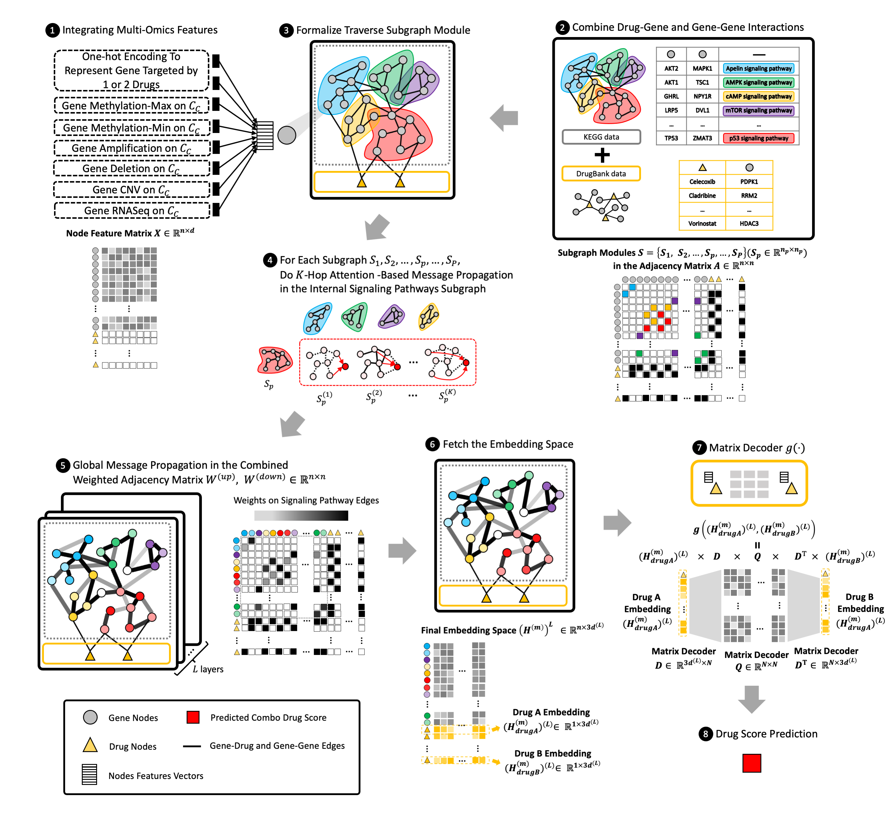
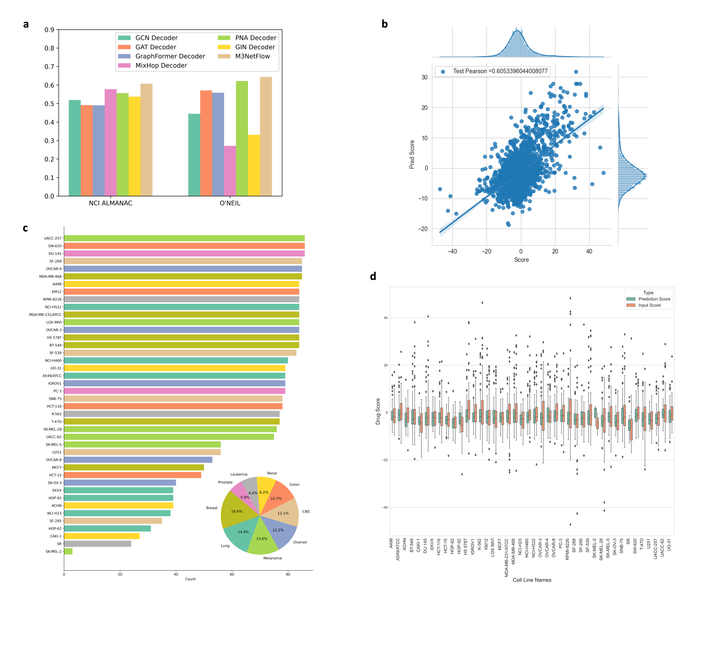
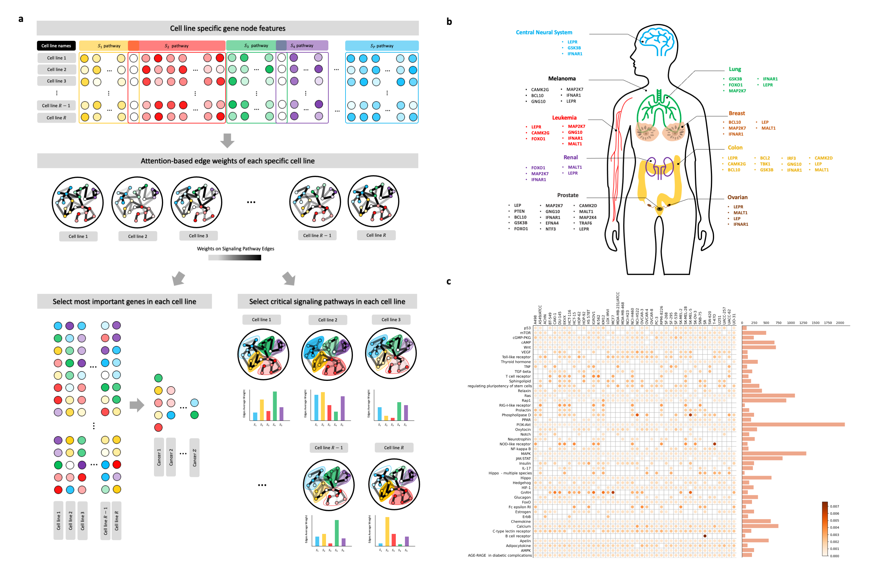
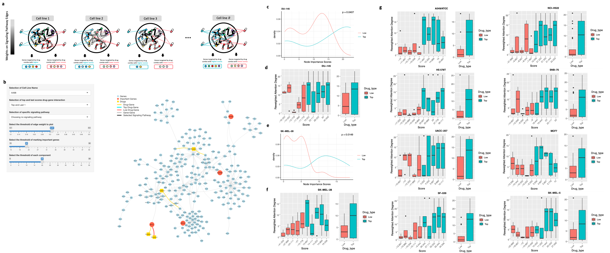

# M3NetFlow

## 1. Model Overall Architecture


## 2. Parsing the Raw Data Files

```
python post_parse.py
```

## 3. Run the Model to Get Prediction

```
python geo_tmain_path_tsgnn.py
```
### 3.1 Model Performance and comparisons


## 4. Analysing the Result to Give Interpretation
### (1) Run each fold analysis to extract the attention in subnetwork
```
python geo_analysis_path_tsgnn.py
```

### (2) Average attention scores for edges in each fold
```
python analysis_path_edge.py
```

### (3) Filter attention network in R without reweighting first (whole_net / sub_net)
```
setwd('/Users/muhaha/Files/VS-Files/M3NetFlow')
cell_map_dict_df = read.csv('./datainfo-nci/filtered_data/cell_line_map_dict.csv')
fold_n = 0
num_cell = length(cell_map_dict_df[[1]])
for (x in 1:num_cell){
  each_cell_search_gene(fold_n, x, edge_threshold = 0.2, giant_comp_threshold = 20, whole_net = F, reweight=F)
}
```

```
setwd('/Users/muhaha/Files/VS-Files/M3NetFlow')
cell_map_dict_df = read.csv('./datainfo-nci/filtered_data/cell_line_map_dict.csv')
fold_n = 0
num_cell = length(cell_map_dict_df[[1]])
for (x in 1:num_cell){
  each_cell_search_gene(fold_n, x, edge_threshold = 0.2, giant_comp_threshold = 20, whole_net = T, reweight=F)
}
```

### (4) Create 'cell line - gene' degree map with TF-IDF and non TF-IDF
```
python analysis_cell_node.py
```



### (5) Model Results and Our Vistualization Tool VisNetFlow


* visit the website: https://m3netflow.shinyapps.io/NetFlowVis/ for our tool VisNetFlow

