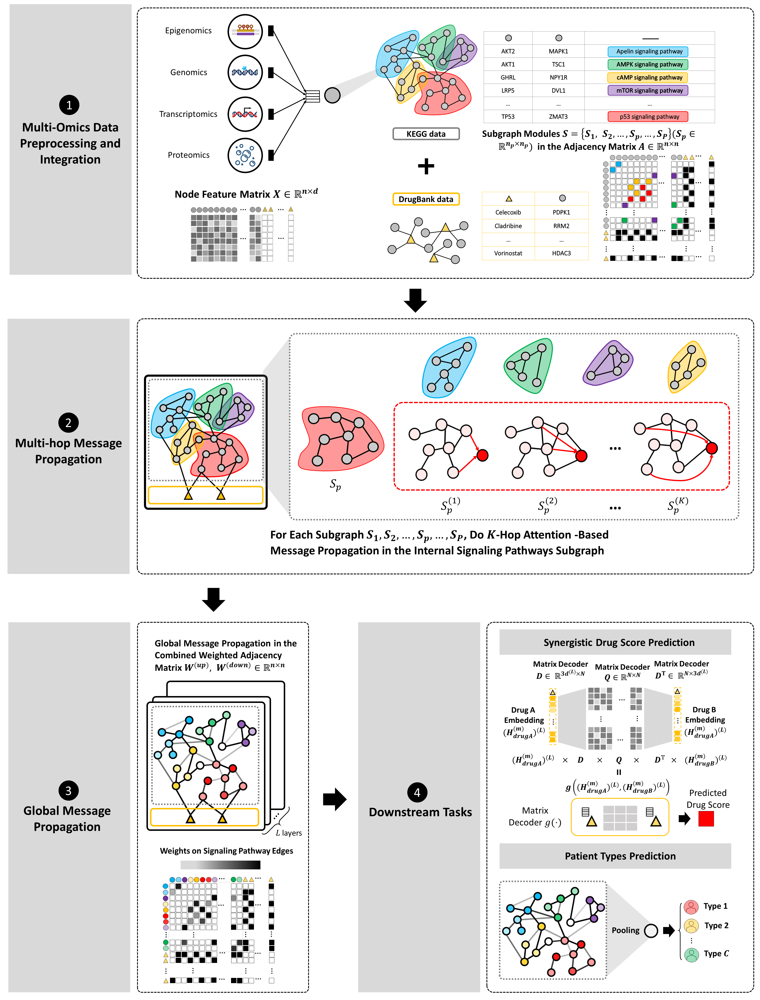
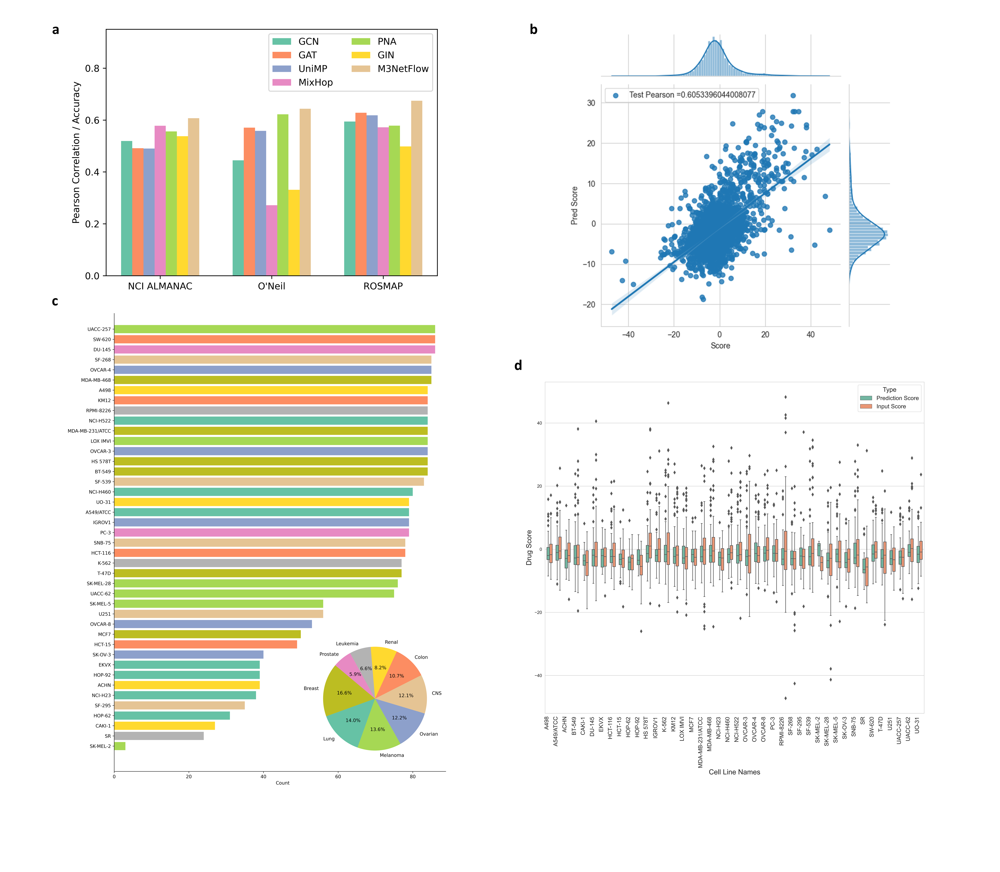
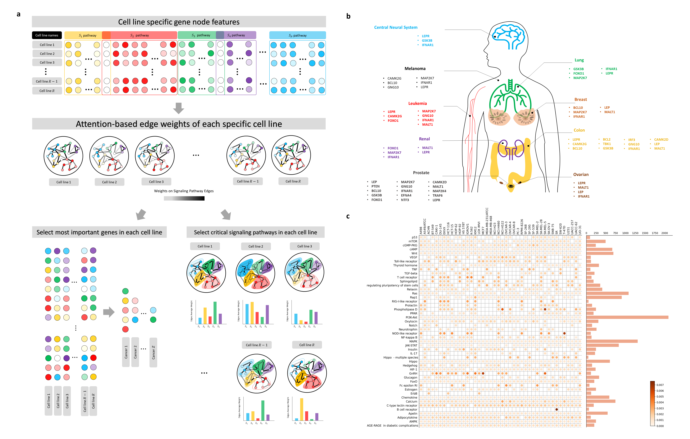
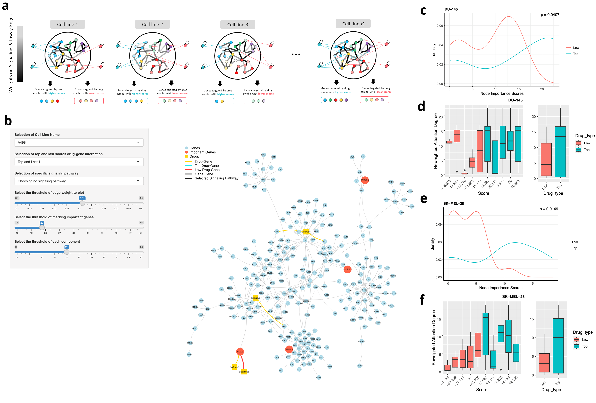

# M3NetFlow

## 1. Model Overall Architecture


## 2. Parsing the Raw Data Files
### 2.1 Preprocess the raw datasets for cancer dataset
```
python ./parse/init_parse.py

python ./parse/parse_circle.py

python ./parse/parse_network.py
```
Afterwards, parse dataset into the graph AI ready format
In post_parse.py file, you may change the dataset parameter with *datainfo-nci* or *datainfo-oneil*. Also, fold number can be modified with changing 'n_fold' = [1-5]

```
python post_parse.py
```

### 2.2 Preprocess the raw datasets for ROSMAP AD dataset
Change directory into 'M3NetFlow_AD', check file 'ROSMAP_union_raw_data_process_AD.ipynb' to parse raw datasets. Afterwards, run 
```
python load_data.py
```

## 3. Run the Model to Get Prediction
### 3.1 Run the M3NetFlow model
By checking the file 'geo_tmain_m3netflow.py' in current folder or changing directory into './M3NetFlow_AD', you can change the parameters 'dataset' and 'fold_n'.
```
python geo_tmain_m3netflow.py
```

### 3.2 Run other baseline models
```
python geo_tmain_gcn.py
python geo_tmain_gat.py
python geo_tmain_gformer.py
python geo_tmain_mixhop.py
python geo_tmain_pna.py
python geo_tmain_gin.py
```

Tips: For model performance on ROSMAP AD dataset, you can change directory into folder 'M3NetFlow'

### 3.3 Model Performance and comparisons


## 4. Analysing the Result to Give Interpretation for Cancer Datasets
### 4.1 Run each fold analysis to extract the attention in subnetwork
```
python geo_analysis_m3netflow.py
```

### 4.2 Average attention scores for edges in each fold
```
python analysis_path_edge.py
```

### 4.3 Filter attention network in R without reweighting first (whole_net / sub_net)
```
setwd('/Users/muhaha/Files/VS-Files/M3NetFlow')
cell_map_dict_df = read.csv('./datainfo-nci/filtered_data/cell_line_map_dict.csv')
fold_n = 0
num_cell = length(cell_map_dict_df[[1]])
for (x in 1:num_cell){
  each_cell_search_gene(fold_n, x, edge_threshold = 0.2, giant_comp_threshold = 20, whole_net = F, reweight=F)
}
```

### 4.4 Create 'cell line - gene' degree map with TF-IDF and non TF-IDF
By adding the TF-IDF weight to the node importance, the node / gene importance of each specific cell line has been generated by following python file.
```
python analysis_cell_node.py
```

And in 'kegg_path.ipynb', we can generate the Figure 4c.




### 4.5 Model Results and Our Vistualization Tool VisNetFlow
To genreate the visualization application, the file 'shinyapp_graph_neo_drug.R' can be used to generate the GUI. 



* visit the website: https://m3netflow.shinyapps.io/NetFlowVis/ for our tool NetFlowVis

### 4.6 Detailed tutorial for NetFlowVis
In the web-based user interface, the left panel can control the cancer-specific results. 
* Selection of Cell Line Name
  * Choose the specific cell line name to analysis

* Selection of top and last scores drug-gene interaction
There are 10 options for comparing the top and last drug scores. For instance, the application set the comparisons with pairs of top 1 drug combination and last 1 drug combination, top 2 drug combination and last 2 drug combination, etc.

* Selection of specific signaling pathway
There are 48 siganling pathways available for user to analysis. By selecting the signaling pathway, the related edges or paths will be highlighted in bold black color.

* Select the threshold of edge weight to plot
By selecting or changing the edge weight in the range from 0.1 to 0.5 (default value as 0.31), the edge weight under such threshold will be filtered out of the visualization.

* Select the threshold of marking important genes
By changing the threshold of important genes, the node marked as important nodes will be enlarged and modified into tomoto color.

* Select the threshold of each component
Updating the threshold of filtering out the small component by changing this control panel.

## 5. Downstream analysis for ROSMAP AD dataset
For running analysis the biomarkers for ROSMAP AD dataset, you can change the directory into the folder 'M3NetFlow_AD'.
### 5.1 Run each fold analysis to extract the attention in subnetwork
```
python ROSMAP_analysis_path_edge.py
```

### 5.2 Average attention scores for edges in each fold
```
python ROSMAP_analysis_avg_and_pvalue.py
```

### 5.3 Pathway Enrichment Analysis for ROSMAP AD dataset
To generate the visualization application on ROSMAP AD dataset, use the R code './M3NetFlow_AD/shinyapp_graph_neo_drug-omics-pvalues.R'.


* visit the website: https://m3netflow.shinyapps.io/NetFlowVis-AD/ for our tool NetFlowVis-AD

### 5.4 Detailed instruction on application tool NetVisFlow-AD
In the web-based user interface, the left panel can control the cancer-specific results. 
* Selection of Patient Type
  * Choose the specific type of patient (AD vs Non-AD)

* Selection of specific signaling pathway
There are 48 siganling pathways available for user to analysis. By selecting the signaling pathway, the related edges or paths will be highlighted in bold black color.

* Select the threshold of edge weight to plot
By selecting or changing the edge weight in the range from 0 to 0.25 (default value as 0.106), the edge weight under such threshold will be filtered out of the visualization.

* Select the threshold of marking important genes by p-values
By changing the threshold of important genes measured by p-values (comparing AD vs Non-AD), the node marked as important nodes will be enlarged and modified into tomoto color.

* Select the threshold of each component
Updating the threshold of filtering out the small component by changing this control panel.

The rest panel can only change the visualization details of the plot:
* Select the gene node size: changing the common node size
* Select the important gene node size: modifying the size of the important nodes
* Select the label size of gene nodes: changing the label or font size of common nodes
* Select the label size of important genes: changing the font size of important genes